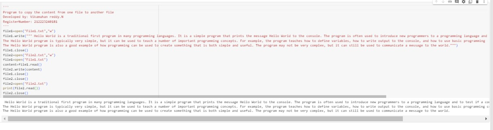

# copy-file
## AIM:
To write a python program for copying the contents from one file to another file.
## EQUIPEMENT'S REQUIRED: 
PC
Anaconda - Python 3.7
## ALGORITHM: 
### Step 1:
Create a variable file1 and give a text file named "File1.txt" in write mode and write some content

### Step 2: 
Close the file 
### Step 3: 
Open a another file in the variable named file2 in text file named "File2.txt" write mode
### Step 4: 
Open the text again "File1.txt" in read mode
### Step 5: 
Then create a variable and add the content in the file2 using write() 
### Step 6: 
Then the close both the file and open the "File2.txt" in write mose and print the content for confirmation and close the file

## PROGRAM:
```py
''' 
Program to copy the content from one file to another file
Developed by: Vikamuhan reddy.N
RegisterNumber: 212223240181
'''
file1=open("File1.txt","w")
file1.write(""" Hello World is a traditional first program in many programming languages. It is a simple program that prints the message Hello World to the console. The program is often used to introduce new programmers to a programming language and to test if a compiler or interpreter is working properly.
The Hello World program is typically very simple, but it can be used to teach a number of important programming concepts. For example, the program teaches how to define variables, how to write output to the console, and how to use basic programming constructs such as loops and conditional statements.
The Hello World program is also a good example of how programming can be used to create something that is both simple and useful. The program may not be very complex, but it can still be used to communicate a message to the world.""")
file1.close()
file2=open("File2.txt","w")
file1=open("File1.txt")
content=file1.read()
file2.write(content)
file1.close()
file2.close()
file2=open("File2.txt")
print(file2.read())
file2.close()

```

### OUTPUT:



## RESULT:
Thus the program is written to copy the contents from one file to another file.